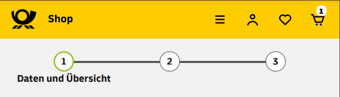

# Платежная форма. 

## Как это вообще получилось? 
В поисках заработка на фрилансе, просматривая бесчисленное количество разных объявлений, наткнулся на покупателя которому требовалось сверстать платёжную форму. Без макета, только pdf, в описании указано, что разрешение не должно превышать 668px. Посмотрел, не придал значения, продолжил поиски. Через некоторое время решил вернуться к этому варианту, но объявления уже не было, зато остался макет. Подумал, почему бы и нет? Попробую себя в scss, заодно попробую сверстать без макета, используя скиншоттер в качестве линейки. 

## Что в итоге?
Обычная платёжная форма на немецком языке. Не сильно вникал в смысл для чего она нужна, да и не в этом цель. 
Для разработки использовал:
- HTML5
- SCSS
  
  До этого, в рамках обучения на ЯПрактикуме, я не особо любил (может не хотел) использовать относительные величины. Решил наверстать и применить подход резиновой верстки. Приложение тянется от 280px до 668px, но комфортно просматривать от 350px. Для запуска использовал liveServer. Пробовал открыть сам index.html, но в этом случае не работают чекбоксы. 
 
